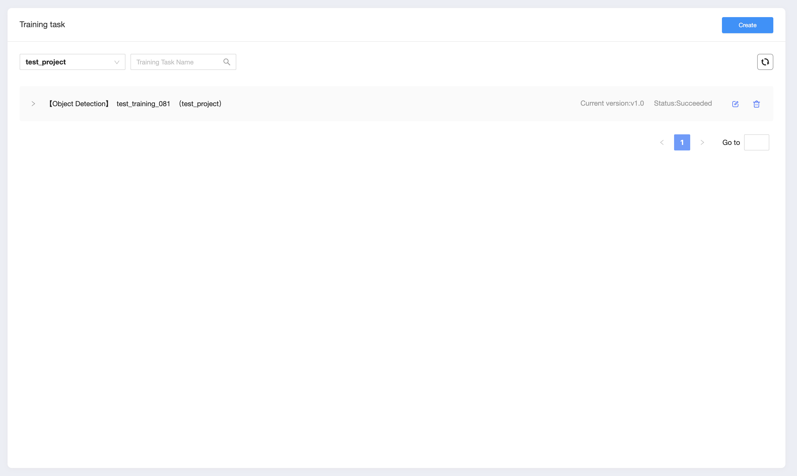
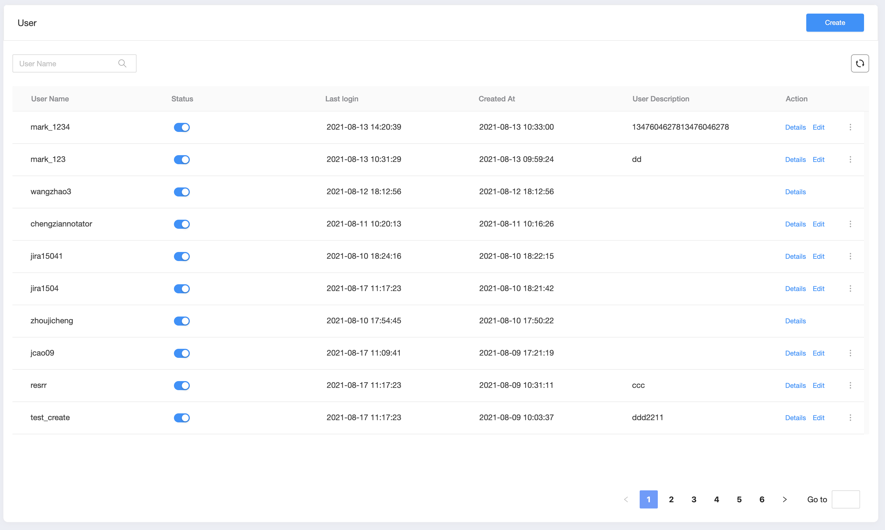
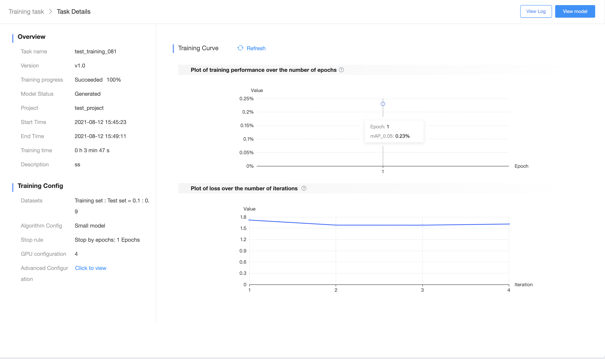
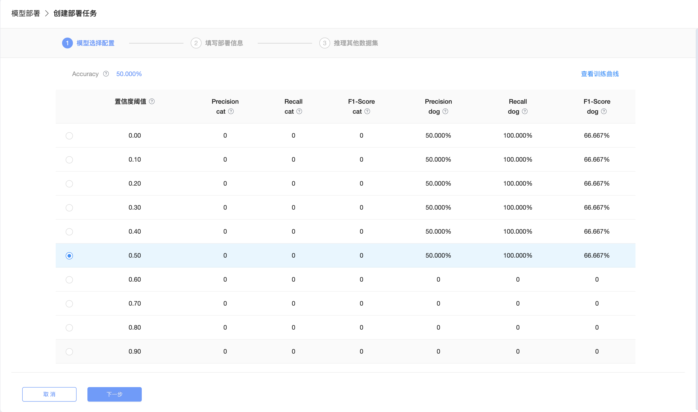
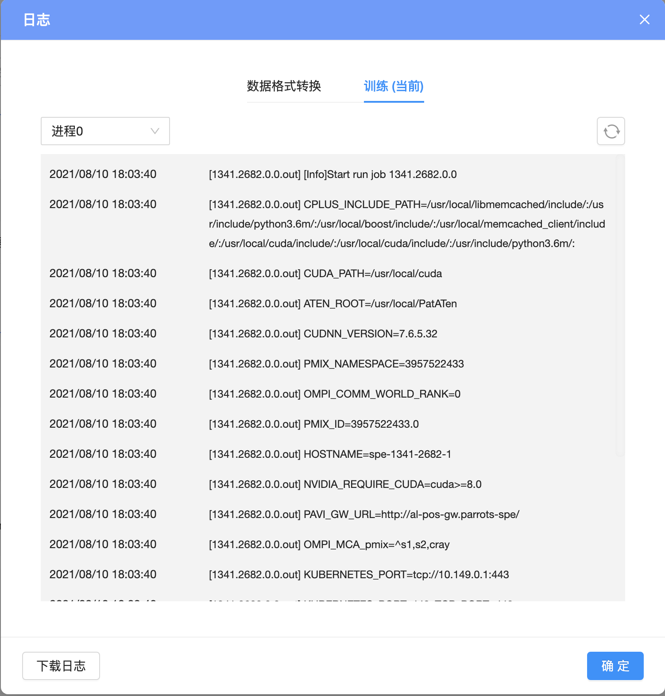

# DCP-Components

这里放置了 DCP 系统的通用组件库，目前包含 SPE 系统的通用组件如下

| 系统 | 组件 | 功能 | 版本 |
| SPE | Breadcrumb | SPE 样式面包屑 | --- |
| SPE | Card | SPE Card 容器组件 | --- |
| SPE | CollapseTable | SPE 手风琴表格组件 | --- |
| SPE | Logger | SPE 日志组件 | --- |
| SPE | Steps | SPE 步骤组件 | --- |
| SPE | Tabs | SPE 页签组件 | --- |
| SPE | View | SPE 页容器组件 | --- |

## layout 页面级

### 1. 列表页 layout - 左侧 title，右侧 action，有筛选 area，可以带 reset & refeash，下侧是列表显示

#### CollapseTable

#### table

### 2. 详情 layout - 顶层 breadcrumb，右侧 action，内容部分左右布局，左侧小标题 + kv 结构，右侧自定义内容区

### 3. Tab layout - 顶层 breadcrumb，右侧 action，Tabs 区域，右侧自定义内容区

### 4. step layout - 顶层 breadcrumb，右侧 action，Tabs 区域，右侧自定义内容区

## 显示

### Breadcrumb - 面包屑

### Logger

除部署侧的 logger 外，其他的都已经统一到 logger

### Steps

页面中

弹框中

### Card

